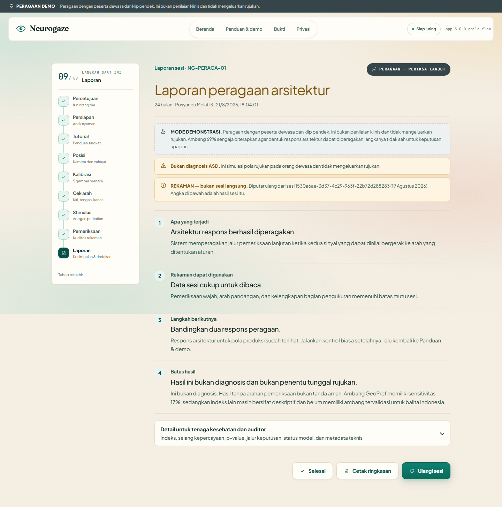
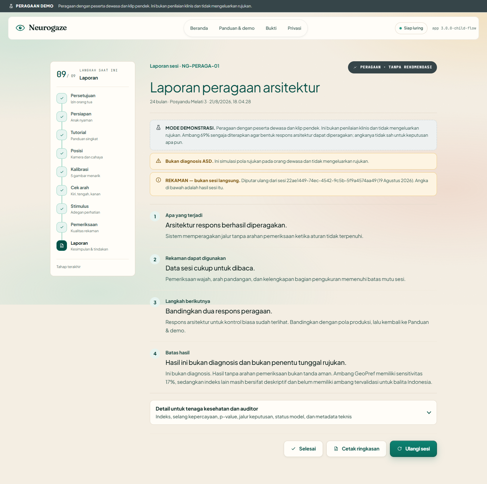

# Neurogaze

**Arsitektur inferensi bergerbang untuk riset pengukuran atensi di Posyandu.** PWA statis
yang berjalan luring di tablet Android biasa: kamera diproses di perangkat, video mentah
tidak pernah diunggah maupun disimpan, dan tidak ada server di belakangnya. Posyandu
ke-1 dan Posyandu ke-1.000 memuat berkas yang sama.

> Neurogaze bukan alat diagnosis dan belum mengaktifkan rujukan otomatis balita.
> Ambang *rule-in* 69% dari literatur ditahan karena klip lapangan lebih pendek
> daripada protokol tempat titik operasi itu diterbitkan.

**Rujukan otomatis balita ditahan.**

Baterai pengukuran berlangsung 67 detik. Waktu kunjungan juga mencakup izin,
penyiapan, dan kalibrasi. Laporan satu halaman adalah prototipe untuk diuji bersama
tenaga kesehatan; belum ada kader atau praktisi yang mengujinya.

---

## Yang membedakan sistem ini

Hampir semua ML yang dikerahkan ke lapangan mengandaikan data masuk mirip data latihnya.
Ketika andaian itu salah, modelnya tetap mengeluarkan angka — dengan percaya diri, tanpa
memberi tahu siapa pun. Di skrining anak, itu rasa aman palsu yang diserahkan ke orang
tua.

Neurogaze memasang gerbang tepat di titik itu. Tujuh komponen menyusunnya, dan tiap
komponen punya berkas buktinya.

### 1. Fitur dipilih dengan pengukuran, bukan selera

Kamera Posyandu berjalan ~26 fps dan sering lebih lambat. Kami desimasi 27 sesi
berpasangan Gate B yang membawa stempel waktu sungguhan, lalu ukur keluarga fitur mana
yang bertahan:

| Laju efektif | Fitur kinematik | Fitur geometri |
|---|---:|---:|
| 26,2 Hz (dasar) | — | — |
| **13,1 Hz** | **bergeser 69,4%** | **bergeser 1,6%** |
| 8,7 Hz | bergeser 79,7% | bergeser 2,8% |
| 5,2 Hz | bergeser 84,4% | bergeser 5,6% |

Angka 69,4% dan 1,6% adalah median drift relatif akibat desimasi, bukan akurasi
klasifikasi. Hasilnya mendukung pemilihan geometri, tetapi tidak membuat seluruh
fitur geometri kebal: beberapa fitur tetap memiliki pelestarian peringkat lemah atau
drift besar pada laju yang lebih rendah.
[`research/hasil/degradasi_temporal.json`](research/hasil/degradasi_temporal.json)

### 2. Seleksi model yang menjatuhkan model kami sendiri

CNN kami ber-AUC 0,882; regresi logistik 13 fitur ber-AUC 0,823. Yang dikirim: yang
lebih rendah. Bootstrap berpasangan terstratifikasi, 10.000 replikasi, 54 partisipan
yang sama — ΔAUC 0,059 dengan CI95 **[−0,007, +0,137]**, p = 0,087, dan korelasi
prediksi **0,93**. CNN-nya bukan model yang lebih pintar; ia model yang lebih rumit
untuk sinyal yang sama.
[`research/hasil/perbandingan_model.json`](research/hasil/perbandingan_model.json)

### 3. Penjaga out-of-distribution yang berjalan di perangkat, dan terbukti dua arah

Regresi logistik dikirim ke tablet dan dijalankan **setiap sesi**. Penjaga lalu
memutuskan apakah keluarannya boleh dibaca — dan pada stimulus ini ia menolak, sambil
menyebut fitur mana yang di luar distribusi beserta jaraknya. Penolakan itu tercetak di
laporan, bukan disembunyikan.

Penjaga yang hanya pernah menolak tidak dapat dibedakan dari `false` yang dipasang tetap,
jadi ia dijalankan pada dua populasi:

| | Diterima | Mahalanobis median |
|---|---:|---:|
| Domain sumber Carette, 547 vektor | **544** | 10,8 |
| Stimulus yang dikirim, 23 sesi kontrol positif | **1** | 199,2 |

Referensinya dikalibrasi pada persentil 99,5 kohort itu, jadi baris pertama adalah
pemeriksaan kewarasan dan bukan uji generalisasi. Yang menjadi bukti adalah kontrasnya,
dan bahwa seluruh 23 keputusan yang dibuat TypeScript di peramban **dihitung ulang oleh
Python dari log dan menghasilkan verdict yang sama**.
[`app/src/quality/ood.ts`](app/src/quality/ood.ts) ·
[`research/hasil/ood_dua_arah.json`](research/hasil/ood_dua_arah.json)

### 4. Tata kelola yang dijaga type checker

`combinedScore` bernilai `null` dan tidak ada jalur kode yang dapat mengisinya.
Menggabungkan lajur berambang-terbit dengan lajur deskriptif bukan sesuatu yang kami
janjikan tidak akan dilakukan — itu sesuatu yang **tidak dapat dikompilasi**.

### 5. Bobot dari data anak terbit, dan audit yang menolaknya

Memasang bobot antar indeks tidak menuntut merekam balita: data anak berlabel sudah
terbit. Cilia dkk. 2022 (CC BY 4.0, 59 anak, 2,25 juta baris koordinat) dipakai untuk
menghitung indeks di ruang perilaku, bukan ruang piksel. Empat audit beserta kriteria
penolakannya ditulis sebelum fitting dijalankan. Dua gagal, dan yang menentukan adalah ini:

| Prediktor tunggal | AUC |
|---|---:|
| Rasio pelacakan alat | 0,853 |
| Fraksi kedip | 0,847 |
| Fraksi fiksasi | 0,826 |
| Mengikuti isyarat arah *(perilaku)* | **0,504** |

Alas yang tidak memuat satu pun fitur perilaku mencapai AUC 0,905; model indeks perilaku
hanya 0,784. **Pada dataset itu, seberapa baik alatnya merekam seorang anak lebih
memprediksi labelnya daripada apa yang ditatap anak itu.** Bobot tidak dipromosikan,
lapis likelihood-ratio dikirim sendirian, dan penolakannya diterbitkan sebagai hasil.
[`research/hasil/model_rujukan.json`](research/hasil/model_rujukan.json)

Dan kami menjalankan audit yang sama pada data sendiri. Mutu rekaman tingkat sesi saja,
pada kontrol positif kami: **AUC 0,537, p = 0,26** — kebetulan. Yang memisahkan kedua
kondisi kami adalah perilaku, bukan cara sesinya direkam.
[`research/hasil/audit_shortcut_sendiri.json`](research/hasil/audit_shortcut_sendiri.json)

### 6. Ambang dibandingkan terhadap selang, bukan terhadap satu angka

Klip 16,75 detik hanya menghasilkan sekitar 300 sampel di dalam AOI, jadi galat
pencuplikan berjalan belasan poin. Ambang 69% karena itu dibandingkan dengan selang
kepercayaan 95% sesi; selang yang melintasi ambang membuat sinyalnya *tidak dapat
dinilai*, bukan positif.

| Preferensi sebenarnya | Aturan titik lama | Aturan selang sekarang |
|---:|---:|---:|
| 0,69 — persis di ambang | 52,2% | **4,8%** |
| 0,90 — preferensi tinggi | 100% | **99,0%** |

Lemparan koinnya hilang; sensitivitas pada preferensi tinggi tidak.
[`docs/ambang_selang_kepercayaan.md`](docs/ambang_selang_kepercayaan.md)

### 7. Audit shortcut, dirilis sebagai alat

Pemeriksaan yang menolak bobot lapis 2 tidak berlaku khusus untuk proyek ini. Ia berlaku
untuk siapa pun yang melatih klasifikator pada dua kelompok yang direkam sedikit berbeda,
dan kegagalan yang dicarinya senyap: setiap fitur yang dibaca modelnya tetap punya nama
yang terdengar seperti perilaku.

```bash
python research/shortcut_audit.py data.csv --label kelas     --nuisance n_sampel rasio_pelacakan fraksi_kedip     --behaviour indeks_1 indeks_2 --group id_partisipan
```

Ia dijalankan pada dua arah di repositori ini: `shortcut_present` pada data Cilia, dan
`no_shortcut_detected` pada kontrol positif kami sendiri.
[`research/shortcut_audit.py`](research/shortcut_audit.py)

Bingkai presentasi untuk ketujuhnya ada di [`docs/bingkai_ai.md`](docs/bingkai_ai.md) dan
[`docs/bingkai_kompetisi.md`](docs/bingkai_kompetisi.md).

---

## Apa yang dihasilkan satu sesi

Baterai 67 detik mengukur tiga hal dan melaporkannya terpisah. Blok preferential
looking berjalan kedua, tepat sesudah blok atensi pembuka, karena ia membawa
satu-satunya ambang terbit di sistem ini dan tidak boleh diukur pada anak yang sudah
lelah dan sudah terprimasi secara sosial.

| Lapis | Isinya | Status hari ini |
|---|---|---|
| **A — GeoPref** | Persentase fiksasi geometrik; titik operasi 69% berasal dari Wen dkk. 2022 (n=1.863, usia 12–48 bulan, sensitivitas 17%, spesifisitas 98%) | Persentase dilaporkan, tetapi rujukan otomatis ditahan pada klip 16,75 detik |
| **B — Profil perilaku** | Menghadap layar, gerak kepala, laju kedip, respons nama, mengikuti isyarat dengan uji tanda dalam-sesi | Tidak. Deskriptif, dibaca berdampingan dengan SDIDTK/M-CHAT |
| **B2 — Rekomendasi komposit** | Aturan terbaca atas GeoPref dan kontras mengikuti isyarat | Hanya diperagakan pada orang dewasa; `emitsReferral` tetap `false` |
| **C — Model gabungan berbobot** | Dirancang, belum dipasang. Kalibrasi likelihood-ratio yang tiap sukunya wajib punya sitiran | Belum |

Ambang terbit dibandingkan terhadap **selang kepercayaan 95%** sesi, bukan terhadap satu
titik. Sesi yang mengukur 71% pada cuplikan 16,75 detik tidak dapat dibedakan dari yang
mengukur 67%, jadi selang yang melintasi 69% membuat sinyalnya *tidak dapat dinilai* —
standar yang sama seperti uji tanda pada mengikuti isyarat. Karakteristik operasinya
terhadap aturan titik lama ada di
[`docs/ambang_selang_kepercayaan.md`](docs/ambang_selang_kepercayaan.md).

Tiga indeks sengaja dikeluarkan dari aturan. Menghadap layar dan gerak kepala membawa
AUC preseden tetapi tidak punya ambang yang dapat dipindahkan. Diferensial kedip keluar
karena satu-satunya blok non-aktor di baterai adalah klip preferential looking, sehingga
kontras kedip sosial/non-sosial sepenuhnya terkonfound dengan medium penyajian. Ketiganya
tetap muncul di laporan sebagai ukuran deskriptif.

**Tidak ada pengukuran yang melintasi batas medium.** GeoPref diskor seluruhnya di dalam
klip; mengikuti isyarat membandingkan pasca-isyarat terhadap pra-isyarat di dalam
percobaan vektor yang sama; respons nama adalah deteksi kejadian di dalam blok vektor.

### Laporan yang benar-benar keluar

Dua peragaan dari rekaman terdaftar yang sama-sama lulus mutu: yang kiri memenuhi
aturan, yang kanan tidak. Keduanya membawa spanduk mode demonstrasi dan `emitsReferral`
tetap `false`, karena pesertanya orang dewasa dan klipnya dipersingkat.

| Aturan menyala | Aturan tidak menyala |
|---|---|
|  |  |

Lapis pengasuh muncul lebih dulu — apa yang terjadi, apakah rekamannya terpakai, langkah
berikutnya, batas hasil — sedangkan indeks, selang kepercayaan, p-value, jalur keputusan,
status OOD, dan metadata teknis berada di balik satu pengungkapan. Set lengkap beserta
asal tiap gambar ada di
[`docs/tangkapan_layar/`](docs/tangkapan_layar/README.md).

---

## Status bukti

Bukti terkuat di sini adalah **kontrol positif**: 12 orang dewasa yang menyetujui untuk
dirinya sendiri, 23 sesi direkam pada tiga perangkat, dan 15 lulus mutu. Denominator
per kondisi adalah 9/11 sesi menonton biasa dan 6/12 sesi pola diproduksi yang dapat
dipakai. Dalam mode demonstrasi, aturan menyala pada 0/9 sesi biasa dan 4/6 sesi pola
diproduksi; mode ini tidak mengeluarkan rujukan.

Ini juga bukti pertama di proyek ini yang rantainya utuh dari kamera sampai angka —
direkam lewat aplikasi, lalu **dihitung ulang dari jejak mentah oleh skrip terpisah**
dan menghasilkan angka yang sama.
[`research/hasil/kontrol_positif/README.md`](research/hasil/kontrol_positif/README.md)

Yang **tidak** ditunjukkannya: apa pun tentang autisme. Pesertanya orang dewasa yang
mengikuti naskah, jadi tidak ada sensitivitas, spesifisitas, atau akurasi di dalamnya.
Yang dibuktikannya adalah bahwa instrumennya merespons, dan bahwa rantai pengukurannya
lengkap dan terinstrumentasi.

| Gerbang | Status | Hasil kanonis |
|---|---|---|
| A | **Lulus** | 100 sesi, 25 peserta, 3 perangkat; 94% selesai, galat kalibrasi median 2,207°, frame valid 96,4%, dropout 3,6% |
| B | **Lulus** | 30 perbandingan browser simultan terhadap WebGazer.js 3.5.3; 27 siap, 0,040997 galat ternormalisasi median, agreement AOI 99,7118% dihitung ulang dari koordinat mentah |
| C | Terbuka | Validasi klinis prospektif pada populasi sasaran. 87,8% / 80,8% adalah preseden SenseToKnow, bukan hasil NeuroGaze |
| D | Terbuka | Implementasi lapangan bersama operator Posyandu |

Pembanding Gate B adalah implementasi referensi WebGazer.js, bukan ground truth atau
standar emas. ManyBabies menguji metode itu pada balita 18–27 bulan (Steffan dkk. 2024,
*Infancy*, N=125 di 16 lab). Gate B adalah agreement perangkat lunak; blok target
diketahui head-to-head belum direkam. Angka Gate A 2,36° median / 3,58° p90 pada 94
sesi lulus adalah konversi sudut lama tanpa jarak pandang per sesi, bukan akurasi
absolut eksak atau bukti bahwa NeuroGaze mengungguli angka 4,17° dari protokol lain.

Ekspor mentah, ringkasan turunan, dan manifest SHA-256 ada di
[`research/hasil`](research/hasil). Setiap metrik pasangan diturunkan ulang dari
koordinat mentah oleh [`research/recompute_gate_b.py`](research/recompute_gate_b.py).
Interpretasi lengkap, kriteria penerimaan, dan batas provenance tiap gerbang ada di
[`docs/bukti_gate_a_b.md`](docs/bukti_gate_a_b.md) dan
[`docs/provenance/harness_gate_a_b.md`](docs/provenance/harness_gate_a_b.md).

---

## Stimulus preferential looking

Ambang 69% pernah diterapkan pada dua tes berbeda yang tidak berbagi preseden. Wen dkk.
2022 (*Scientific Reports* 12:4253) memvalidasinya pada **GeoPref asli 62,22 detik** —
n=1.863, sensitivitas 17%, spesifisitas 98%. Moore dkk. 2018 membawa ambang yang sama ke
**Complex Social GeoPref 90 detik** demi konsistensi, melaporkan sensitivitas 18%,
spesifisitas 97%, AUC 0,74 pada sampel jauh lebih kecil. Tiap aset di
[`app/src/geopref/stimulusMeta.ts`](app/src/geopref/stimulusMeta.ts) membawa titik
operasinya sendiri.

Yang dikirim bukan keduanya: **cuplikan 16,75 detik** dari video contoh Complex Social
yang diterbitkan sebagai Additional file 2 Moore dkk. 2018. Maka `validatedProtocol`
bernilai false, ambangnya **ditahan**, dan sesi melaporkan persentase terukur sambil
menyatakan protokolnya disingkat. Permintaan akses stimulus penuh ada di
[`docs/provenance/permintaan_stimulus_ucsd.md`](docs/provenance/permintaan_stimulus_ucsd.md).

Dua sifat aset ini disengaja: **ia senyap** (metode Moore dkk. menyatakan tanpa audio —
jangan tambahkan suara) dan **ia letterboxed** (panel hanya mengisi 19,8% frame 640×360,
jadi aplikasi memangkas sekelilingnya agar geometri sudutnya cocok dengan yang
dilaporkan). `geoprefPanelDegrees()` membuat geometri itu dapat diperiksa per perangkat.

Alasan di balik keputusan yang menentukan batas klaim ada di
[`docs/keputusan_ilmiah.md`](docs/keputusan_ilmiah.md).

---

## Batas yang berlaku hari ini

- Aturan komposit sebagaimana dikirim tidak menyala pada kondisi apa pun: ia menuntut
  dua sinyal menyimpang, dan preferensi geometrik tetap tidak dapat dinilai selama klip
  berlisensi lebih pendek daripada protokol asal ambangnya. Mode demonstrasi menerapkan
  ambang itu sekali, di bawah banner yang menyatakan dirinya demonstrasi, semata agar
  bentuk laporannya terlihat. [`docs/jalur_rujukan.md`](docs/jalur_rujukan.md)
- Tidak ada balita di bukti mana pun di repositori ini, dan tidak akan ada sebelum kaji
  etik. [`docs/etika_perekaman.md`](docs/etika_perekaman.md)
- Validasi prospektif memerlukan mitra yang mampu menjalankan kaji etik, izin orang
  tua, acuan klinis buta, linkage data yang menjaga privasi, rekrutmen, analisis
  fairness/kegagalan, dan validasi prospektif. Ini bukan urusan satu persetujuan administratif.
- Blok target-diketahui Gate B sudah terpasang di sisi analisis, tetapi belum ada sesi
  yang merekamnya.
- Riset primer berhenti di **satu** wawancara praktisi — seorang guru SLB di Jambi, n=1,
  berbasis ingatan. Ia memvalidasi masalahnya, bukan instrumennya, dan tidak menggeser
  satu angka pun. [`docs/wawancara_praktisi_hasil.md`](docs/wawancara_praktisi_hasil.md)
- Belum ada kader yang menguji alur, waktu, kegagalan, pelatihan, atau dukungan.

Status kanonis lima kapabilitas ada di
[`docs/readiness_matrix.md`](docs/readiness_matrix.md) dan bentuk machine-readable-nya
di [`research/hasil/readiness_matrix.json`](research/hasil/readiness_matrix.json).

---

## Menjalankan aplikasi

Dari akar repositori, di Windows:

```powershell
.\start.bat
```

Untuk pengembangan frontend:

```powershell
cd app
npm ci
npm run dev
```

Akses kamera browser menuntut HTTPS atau localhost. Untuk Vercel, pakai `app` sebagai
root direktori proyek.

## Memverifikasi proyek

```powershell
.\.venv\Scripts\python.exe research\gate_evidence_repository.py --rebuild --verify
.\.venv\Scripts\python.exe -m pytest -q
cd app
npm test
npm run lint
```

Daftar periksa rilis lengkap ada di [`docs/verifikasi.md`](docs/verifikasi.md).

## Peta repositori

- `app/`: PWA Next.js, pipeline browser, dan tes frontend.
- `research/`: kode analisis, notebook, evaluasi model, dan bukti kanonis.
- `notebook/`: notebook Kaggle final dan eksperimen pendukung.
- `paper/`: sumber LaTeX dan PDF makalah final.
- `docs/`: interpretasi bukti, protokol, panduan operator, dan verifikasi.
- `huggingface/`: model card dan artefak model tabular yang diekspor.
